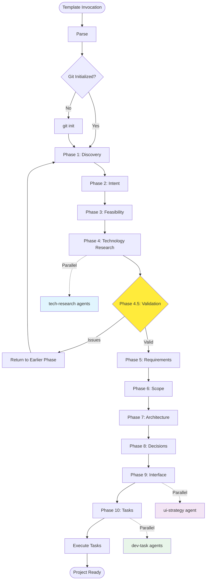

# IDEAL-STI Phase-Based Planning System
## Comprehensive 10-Phase Project Planning with Parallel Subagent Orchestration

**Template Context**: <prompt-template-name>  
**Project Requirements**: <prompt-context>

You are executing a sophisticated 10-phase planning orchestration system that uses git worktrees for parallel execution isolation, structured file rehydration for information flow, and quality gates for phase transitions. Follow the execution protocols exactly as specified.

## System Overview

IDEAL-STI orchestrates a comprehensive 10-phase planning system with parallel subagent execution. It maintains context across all phases while delegating specialized tasks to purpose-built subagents using worktree isolation for parallel execution.



## Template Usage Examples

**Basic Project Planning:**
```
/prompt ideal-sti Build a real-time collaborative task management system with offline support
```

**Complex Enterprise System:**
```
/prompt ideal-sti Create an e-commerce platform with inventory management, payment processing, mobile app, and analytics dashboard
```

The <prompt-context> becomes the project requirements for comprehensive 10-phase analysis with parallel execution.

## Execution Requirements for Claude Code

**MUST Execute Through Bash Tool:**
- All git worktree operations for parallel isolation
- All directory creation and file management commands
- All file rehydration patterns for information flow
- All validation checkpoint logic and quality gates

**MUST Use Task Tool For Parallel Subagents:**
- tech-research agents during Phase 4 (parallel technology investigation)
- ui-strategy agent during Phase 9 (interface design)
- dev-task agents during Phase 10 (implementation tasks)
- qa-analyst agents during Phase 10 (test specification)

**MUST Validate Before Phase Transitions:**
- TODO completion in each phase file using grep patterns
- Quality gate requirements met for each phase
- File existence validation for rehydration dependencies
- Parent directory write access for worktree creation

## Required Directory Structure

When executing this planning system, create this exact structure using Bash tool:

```
project-root/ (current working directory)
├── .git/                              # Git repository (REQUIRED)
├── docs/
│   └── planning/
│       ├── phase1-discovery.md        # Problem elaboration
│       ├── phase2-intent.md           # Goals and metrics
│       ├── phase3-feasibility.md      # Feasibility assessment
│       ├── phase4-tech-research.md    # Technology synthesis
│       ├── phase5-requirements.md     # Requirements
│       ├── phase6-scope.md            # Scope definition
│       ├── phase7-architecture.md     # Architecture design
│       ├── phase8-decisions.md        # Final decisions
│       ├── phase9-interface.md        # Interface specs
│       ├── phase10-tasks.md           # Task summary
│       ├── decisions-registry.md      # All decisions (single file)
│       ├── data-models.md             # Data specifications
│       ├── quality-framework.md       # Quality standards
│       └── lessons-learned.md         # Knowledge base
├── tasks/
│   ├── pending/                       # Tasks not started
│   ├── in-progress/                   # Active tasks
│   └── completed/                     # Finished tasks
├── src/                               # Implementation
└── test/                              # Tests

# Temporary worktrees (created/destroyed during execution in parent directory)
../ (parent directory - MUST BE WRITABLE)
├── worktree-tech-frontend/            # Parallel tech research
├── worktree-tech-backend/             # Parallel tech research
├── worktree-ui-design/                # UI design work
├── worktree-dev-task-001/             # Development task
└── worktree-qa-task-001/              # QA testing
```

**Critical Requirements:**
- Git repository MUST be initialized in project root
- Parent directory MUST be writable for worktree creation
- Planning documents follow exact naming convention for rehydration
- File paths are absolute requirements for information flow between phases

## Main Execution Protocol

Execute this bash function exactly through Bash tool:

```bash
#!/bin/bash
set -euo pipefail

# IDEAL-STI Main Orchestration
main() {
    # Template variable integration point
    ARGUMENTS="<prompt-context>"
    PROJECT_ROOT="$(pwd)"
    
    echo "╔══════════════════════════════════════════════════════════════╗"
    echo "║           IDEAL-STI PHASE-BASED PLANNING SYSTEM              ║"
    echo "╚══════════════════════════════════════════════════════════════╝"
    echo ""
    echo "Project: $ARGUMENTS"
    echo "Root: $PROJECT_ROOT"
    echo ""
    
    # Initialize Git if needed
    if [ ! -d .git ]; then
        echo "Initializing Git repository..."
        git -C "$(pwd)" init
        echo "*.log\nnode_modules/\n.env\n.DS_Store" > .gitignore
        git -C "$(pwd)" add .gitignore
        git -C "$(pwd)" commit -m "Initial commit" || true
    fi
    
    # Initialize state management for concurrent execution
    initialize_worktree_state
    
    # Scan and aggregate knowledge from knowledge folders
    scan_knowledge_folders
    
    # Create planning structure
    mkdir -p docs/planning
    mkdir -p tasks/{pending,in-progress,completed}
    
    # Initialize tracking state
    cat > docs/planning/.state.md << EOF
# IDEAL-STI Execution State
- Started: $(date -Iseconds)
- Prompt: $ARGUMENTS
- Current Phase: 1
- Status: Active
EOF
    
    # Execute phases sequentially with enhanced validation
    for PHASE in {1..10}; do
        execute_phase "$PHASE" "$ARGUMENTS"
        
        # Enhanced validation checkpoints
        case "$PHASE" in
            "2") execute_goals_validation ;;
            "4") execute_validation_checkpoint ;;
            "6") execute_scope_validation ;;
            "8") execute_decision_validation ;;
        esac
        
        # Quality gate check with adaptive intelligence
        if ! check_phase_quality "$PHASE"; then
            echo "⚠️ Phase $PHASE quality gate failed"
            
            # Analyze failure and suggest recovery
            FAILURE_ANALYSIS=$(analyze_phase_failure "$PHASE")
            echo "Analysis: $FAILURE_ANALYSIS"
            
            read -p "Continue anyway? (y/n/r for recovery) " -n 1 -r
            echo
            case $REPLY in
                [Rr]*) execute_failure_recovery "$PHASE" ;;
                [Yy]*) continue ;;
                *) exit 1 ;;
            esac
        fi
        
        # Check for runtime adaptations needed
        check_adaptive_requirements "$PHASE" "$ARGUMENTS"
    done
    
    # Execute generated tasks
    execute_task_queue
    
    echo ""
    echo "✅ IDEAL-STI Planning Complete!"
    echo "📁 Planning: docs/planning/"
    echo "📋 Tasks: tasks/"
}

# Test parent directory access (CRITICAL)
test_parent_access() {
    if ! touch "../.test-$$" 2>/dev/null; then
        echo "FATAL: Cannot access parent directory for worktree creation"
        echo "Details: Worktrees must be created in parent directory"
        echo "Current directory: $(pwd)"
        echo "Parent directory: $(dirname "$(pwd)")"
        echo "Parent permissions: $(ls -ld ../ 2>&1)"
        exit 1
    fi
    rm "../.test-$$"
}

# Adaptive Intelligence Framework
check_adaptive_requirements() {
    local phase="$1"
    local arguments="$2"
    
    # Analyze discoveries from current phase for plan impact
    if [ -f "docs/planning/.discoveries-${phase}.md" ]; then
        DISCOVERY_DATA=$(cat "docs/planning/.discoveries-${phase}.md")
        IMPACT_ANALYSIS=$(analyze_discovery_impact "$DISCOVERY_DATA" "$phase")
        
        if [ "$IMPACT_ANALYSIS" = "CRITICAL" ]; then
            echo "🔄 Critical discovery detected, adapting execution plan..."
            adapt_execution_plan "$phase" "$DISCOVERY_DATA"
        fi
    fi
}

analyze_discovery_impact() {
    local discovery_data="$1"
    local phase="$2"
    
    # Pattern matching for critical discoveries
    if echo "$discovery_data" | grep -qi "impossible\|infeasible\|major constraint\|critical dependency"; then
        echo "CRITICAL"
    elif echo "$discovery_data" | grep -qi "significant\|important\|requires attention"; then
        echo "MODERATE"
    else
        echo "MINOR"
    fi
}

adapt_execution_plan() {
    local current_phase="$1"
    local discovery_data="$2"
    
    echo "📋 Adapting remaining phases based on discoveries..."
    
    # Create adaptation log
    cat >> docs/planning/.adaptations.md << EOF
## Adaptation at Phase $current_phase
- **Timestamp**: $(date -Iseconds)
- **Discovery**: $discovery_data
- **Impact**: Critical - execution plan modified
- **Actions**: [Will be filled by adaptive logic]

EOF

    # Determine if emergency research phase needed
    if echo "$discovery_data" | grep -qi "technology\|technical"; then
        insert_emergency_phase "$current_phase" "technical"
    elif echo "$discovery_data" | grep -qi "stakeholder\|user\|requirement"; then
        insert_emergency_phase "$current_phase" "requirements"
    fi
}

insert_emergency_phase() {
    local after_phase="$1"
    local emergency_type="$2"
    
    echo "🚨 Inserting emergency ${emergency_type} research phase after Phase ${after_phase}"
    
    # Create emergency research phase
    mkdir -p "docs/planning/emergency"
    cat > "docs/planning/emergency/phase-${after_phase}5-${emergency_type}.md" << EOF
# Emergency Phase ${after_phase}.5: ${emergency_type^} Research

## Trigger
Critical discovery in Phase ${after_phase} requires additional research.

## Research Focus
- **Type**: ${emergency_type}
- **Urgency**: High
- **Scope**: Targeted investigation

## TODO for continuation
- [ ] Complete emergency research
- [ ] Update affected downstream phases
- [ ] Validate assumptions

EOF
    
    # Execute emergency research
    execute_emergency_research "${after_phase}5" "$emergency_type"
}

analyze_phase_failure() {
    local phase="$1"
    local phase_file="docs/planning/phase${phase}-*.md"
    
    # Analyze common failure patterns
    if [ ! -f $phase_file ]; then
        echo "Missing phase file - execution did not complete"
    elif grep -q '\[ \]' $phase_file; then
        INCOMPLETE_TODOS=$(grep -c '\[ \]' $phase_file)
        echo "${INCOMPLETE_TODOS} incomplete TODO items detected"
    else
        echo "Quality validation failed - content may be insufficient"
    fi
}

execute_failure_recovery() {
    local phase="$1"
    
    echo "🔧 Executing failure recovery for Phase $phase..."
    
    # Phase-specific recovery strategies
    case $phase in
        1) echo "- Review stakeholder identification completeness"; echo "- Validate use case coverage"; echo "- Check requirement depth" ;;
        2) echo "- Ensure goals are measurable"; echo "- Validate success metrics"; echo "- Check timeline feasibility" ;;
        3) echo "- Review constraint analysis"; echo "- Validate risk assessment"; echo "- Check feasibility rationale" ;;
        *) echo "- Review phase completeness"; echo "- Validate information flow"; echo "- Check downstream dependencies" ;;
    esac
    
    # Allow manual intervention
    read -p "Press Enter after addressing issues..." -r
}

# Enhanced Validation Checkpoint System
execute_goals_validation() {
    echo "=== Phase 2.5: Goals Validation Checkpoint ==="
    
    # Validate measurable success metrics exist
    if ! grep -qi "metric\|kpi\|measurable\|quantifiable" docs/planning/phase2-intent.md; then
        echo "⚠️ Warning: No measurable success metrics found"
        VALIDATION_ISSUES="${VALIDATION_ISSUES}\n- Missing measurable metrics"
    fi
    
    # Check stakeholder alignment from Phase 1
    PHASE1_STAKEHOLDERS=$(grep -c "stakeholder\|user" docs/planning/phase1-discovery.md 2>/dev/null || echo 0)
    PHASE2_ALIGNMENT=$(grep -c "stakeholder\|user" docs/planning/phase2-intent.md 2>/dev/null || echo 0)
    
    if [ "$PHASE2_ALIGNMENT" -lt "$PHASE1_STAKEHOLDERS" ]; then
        echo "⚠️ Warning: Goals may not align with all stakeholders identified"
        VALIDATION_ISSUES="${VALIDATION_ISSUES}\n- Stakeholder-goal misalignment"
    fi
    
    # Ensure goals are achievable within constraints
    if grep -qi "unlimited\|infinite\|no constraint" docs/planning/phase2-intent.md; then
        echo "⚠️ Warning: Goals may be unrealistic"
        VALIDATION_ISSUES="${VALIDATION_ISSUES}\n- Potentially unrealistic goals"
    fi
    
    # If issues found, offer backtracking
    if [ -n "$VALIDATION_ISSUES" ]; then
        echo "Goals validation issues found:"
        echo -e "$VALIDATION_ISSUES"
        read -p "Return to Phase 1 for clarification? (y/n) " -n 1 -r
        echo
        if [[ $REPLY =~ ^[Yy]$ ]]; then
            execute_phase 1 "$ARGUMENTS"
            execute_phase 2 "$ARGUMENTS"
        fi
    else
        echo "✓ Goals validation passed"
    fi
}

execute_scope_validation() {
    echo "=== Phase 6.5: Scope Validation Checkpoint ==="
    
    # Validate scope aligns with requirements (Phase 5)
    REQUIREMENTS_COUNT=$(grep -c "requirement\|must\|shall" docs/planning/phase5-requirements.md 2>/dev/null || echo 0)
    SCOPE_COVERAGE=$(grep -c "requirement\|must\|shall" docs/planning/phase6-scope.md 2>/dev/null || echo 0)
    
    if [ "$SCOPE_COVERAGE" -lt "$REQUIREMENTS_COUNT" ]; then
        echo "⚠️ Warning: Scope may not cover all requirements"
        VALIDATION_ISSUES="${VALIDATION_ISSUES}\n- Incomplete requirement coverage in scope"
    fi
    
    # Check resource constraints vs. scope ambition
    if grep -qi "extensive\|comprehensive\|full-featured" docs/planning/phase6-scope.md && \
       grep -qi "limited\|constrained\|tight" docs/planning/phase5-requirements.md; then
        echo "⚠️ Warning: Scope ambition may exceed resource constraints"
        VALIDATION_ISSUES="${VALIDATION_ISSUES}\n- Scope-resource mismatch"
    fi
    
    # Ensure MVP definition is viable
    if ! grep -qi "mvp\|minimum\|phase 1\|initial" docs/planning/phase6-scope.md; then
        echo "⚠️ Warning: No clear MVP definition found"
        VALIDATION_ISSUES="${VALIDATION_ISSUES}\n- Missing MVP definition"
    fi
    
    # Handle validation issues
    if [ -n "$VALIDATION_ISSUES" ]; then
        echo "Scope validation issues found:"
        echo -e "$VALIDATION_ISSUES"
        read -p "Return to Phase 5 for requirements clarification? (y/n) " -n 1 -r
        echo
        if [[ $REPLY =~ ^[Yy]$ ]]; then
            execute_phase 5 "$ARGUMENTS"
            execute_phase 6 "$ARGUMENTS"
        fi
    else
        echo "✓ Scope validation passed"
    fi
}

execute_decision_validation() {
    echo "=== Phase 8.5: Decision Validation Checkpoint ==="
    
    # Validate decisions support architecture (Phase 7)
    if ! grep -qi "architecture\|design\|pattern" docs/planning/phase8-decisions.md; then
        echo "⚠️ Warning: Decisions may not properly support architecture"
        VALIDATION_ISSUES="${VALIDATION_ISSUES}\n- Decisions-architecture disconnect"
    fi
    
    # Check trade-offs align with goals (Phase 2)
    PHASE2_PRIORITIES=$(grep -i "priority\|important\|critical" docs/planning/phase2-intent.md | wc -l)
    PHASE8_TRADEOFFS=$(grep -i "trade-off\|compromise\|balance" docs/planning/phase8-decisions.md | wc -l)
    
    if [ "$PHASE8_TRADEOFFS" -eq 0 ] && [ "$PHASE2_PRIORITIES" -gt 0 ]; then
        echo "⚠️ Warning: No trade-offs documented despite multiple priorities"
        VALIDATION_ISSUES="${VALIDATION_ISSUES}\n- Missing trade-off analysis"
    fi
    
    # Ensure decision rationale is documented
    DECISIONS_COUNT=$(grep -c "decision\|choose\|select" docs/planning/phase8-decisions.md 2>/dev/null || echo 0)
    RATIONALE_COUNT=$(grep -c "because\|rationale\|reason\|justification" docs/planning/phase8-decisions.md 2>/dev/null || echo 0)
    
    if [ "$RATIONALE_COUNT" -lt "$DECISIONS_COUNT" ]; then
        echo "⚠️ Warning: Some decisions lack documented rationale"
        VALIDATION_ISSUES="${VALIDATION_ISSUES}\n- Insufficient decision rationale"
    fi
    
    # Handle validation issues
    if [ -n "$VALIDATION_ISSUES" ]; then
        echo "Decision validation issues found:"
        echo -e "$VALIDATION_ISSUES"
        read -p "Return to Phase 7 for architecture review? (y/n) " -n 1 -r
        echo
        if [[ $REPLY =~ ^[Yy]$ ]]; then
            execute_phase 7 "$ARGUMENTS"
            execute_phase 8 "$ARGUMENTS"
        fi
    else
        echo "✓ Decision validation passed"
    fi
}
```

## Critical Information Flow Patterns

**Phase Dependencies (BREAKING ANY LINK COMPROMISES SYSTEM INTEGRITY):**

```bash
# Phase 1 → Phase 2: Discovery findings rehydration
PHASE1_CONTENT=$(cat docs/planning/phase1-discovery.md)

# Phase 2 → Phase 3: Goals and metrics rehydration  
PHASE2_GOALS=$(grep -A5 "Success Metrics" docs/planning/phase2-intent.md)

# Phase 3 → Phase 4: Constraints and feasibility rehydration
PHASE3_CONSTRAINTS=$(cat docs/planning/phase3-feasibility.md)

# Phase 4 → Phase 4.5: Technology research synthesis rehydration
PHASE4_TECH=$(cat docs/planning/phase4-tech-research.md)

# Phase 4.5 Validation Loop Logic (CRITICAL)
if [ "$CRITICAL_IMPACTS" -gt 0 ]; then
    echo "Returning to Phase 1 for requirement clarification" 
    RESUME_PHASE=1
    execute_phase "$RESUME_PHASE" "$ARGUMENTS"
fi

# Continues through all 10 phases with exact rehydration patterns
```

## Phase Execution Functions

### Phase 1: Discovery & Problem Elaboration

Execute this bash function exactly:

```bash
execute_phase_1() {
    local arguments="$1"
    
    echo "=== Phase 1: Discovery & Problem Elaboration ==="
    
    # Execute parallel stakeholder research
    execute_stakeholder_research "$arguments"
    
    # Execute contrarian analysis
    execute_contrarian_analysis "1" "problem definition"
    
    cat > docs/planning/phase1-discovery.md << EOF
# Phase 1: Discovery & Problem Elaboration

## Original Request
$arguments

## Expanded Problem Statement
[AI will elaborate the minimal input into comprehensive understanding]

## Research-Enhanced Stakeholder Analysis
### Primary Users
- [Description, needs, pain points, validated through research]

### Secondary Users  
- [Description, needs, pain points, validated through research]

### Hidden Stakeholders
- [Compliance, support, partners, regulatory bodies discovered through research]

### Competitive Landscape
- [Direct competitors and their approaches]
- [Indirect competitors and alternative solutions]
- [Emerging threats and market disruptors]

## Use Cases Discovered
### Primary Flow
1. [Step-by-step main use case validated through market research]

### Alternative Flows
[5+ alternative scenarios validated through competitive analysis]

### Edge Cases
[10+ edge cases including null data, concurrent access, failures, regulatory scenarios]

## Research-Validated Requirements
### Performance (Research-Backed)
- Response time expectations (industry benchmarks)
- Concurrent user capacity (market analysis)
- Data volume projections (growth patterns)

### Security (Compliance Research)
- Authentication needs (regulatory requirements)
- Authorization levels (industry standards)
- Audit requirements (legal research)
- Data encryption (compliance mandates)

### Operational (Market Research)
- Monitoring requirements (industry practices)
- Backup strategies (regulatory requirements)
- Deployment constraints (technical research)

## ⚠️ CRITICAL ANTI-PATTERNS - WHAT NOT TO DO

### Common Failure Modes
- **Assumption-based stakeholder identification** - Always validate through research
- **Single-source requirement gathering** - Cross-reference with multiple sources
- **Ignoring regulatory stakeholders** - Always research compliance requirements
- **Shallow use case analysis** - Go beyond obvious primary flows

### Validation Red Flags
- Only obvious stakeholders identified (missing hidden ones)
- No competitive research or market context
- Requirements based purely on initial request
- Missing regulatory or compliance considerations

### Recovery Strategies
- Launch emergency stakeholder research if gaps found
- Conduct competitive analysis if market context missing
- Research regulatory requirements if compliance unclear
- Expand use case analysis if scenarios too narrow

## Research Discoveries Log
[Populated by parallel research agents - critical findings that may require plan adaptation]

## TODO for Phase 2
- [ ] Define measurable success metrics based on research findings
- [ ] Establish concrete goals aligned with market realities
- [ ] Create outcome definitions validated through competitive analysis
- [ ] Set timeline expectations based on industry benchmarks
- [ ] Quantify user satisfaction targets using market data
EOF
}

# Dynamic Runtime Research Framework - Phase 1
execute_stakeholder_research() {
    local arguments="$1"
    
    echo "=== Phase 1 Research: Stakeholder & Market Analysis ==="
    
    # Test parent directory access first
    test_parent_access
    
    # Define research areas for parallel investigation
    declare -a RESEARCH_AREAS=(
        "competitor:Competitive Analysis:direct,indirect,emerging"
        "market:Market Research:size,trends,regulations"
        "stakeholder:Hidden Stakeholder Discovery:compliance,partners,opponents"
        "regulatory:Regulatory Research:laws,standards,compliance"
    )
    
    # Launch parallel research with worktree isolation
    for area in "${RESEARCH_AREAS[@]}"; do
        IFS=':' read -r key name options <<< "$area"
        
        # Create worktree for isolation (CRITICAL)
        WORKTREE="../worktree-phase1-${key}"
        git -C "$(pwd)" worktree add -b "phase1-research-${key}" "$WORKTREE" 2>/dev/null || {
            git -C "$(pwd)" worktree remove "$WORKTREE" --force 2>/dev/null || true
            git -C "$(pwd)" worktree add -b "phase1-research-${key}" "$WORKTREE"
        }
        
        # Apply current unstaged changes to worktree
        git diff HEAD | git -C "$WORKTREE" apply || true
        
        # Prepare three-parameter invocation for Task tool
        MAIN_PROMPT="Research ${name} for project: $arguments. Focus on: ${options}. Work in worktree $WORKTREE"
        
        TASK_CONFIG=$(cat << EOJSON
{
    "task_id": "phase1-research-${key}",
    "research_area": "${name}",
    "worktree_path": "${WORKTREE}",
    "project_context": {
        "initial_request": "${arguments}",
        "phase": "1-discovery",
        "focus": "${options}"
    },
    "research_depth": "comprehensive",
    "include_sources": true,
    "validate_findings": true
}
EOJSON
)
        
        AGENT_BEHAVIOR=$(cat << EOJSON
{
    "execution_mode": "EXECUTE",
    "analysis_depth": "comprehensive",
    "include_alternatives": true,
    "max_findings": 10,
    "include_sources": true,
    "validate_information": true,
    "create_discovery_log": true
}
EOJSON
)
        
        # Launch tech-research subagent through Task tool for Phase 1 research
        echo "Launching research for ${name}..."
        # MUST USE: Task tool with subagent_type "tech-research" and three parameters
    done
    
    # Wait for all research to complete
    wait
    
    # Merge results back to main branch and synthesize
    for area in "${RESEARCH_AREAS[@]}"; do
        IFS=':' read -r key name options <<< "$area"
        WORKTREE="../worktree-phase1-${key}"
        
        if [ -d "$WORKTREE" ]; then
            # Commit in worktree
            git -C "$WORKTREE" add -A
            git -C "$WORKTREE" commit -m "Phase 1 Research: ${name}" || true
            
            # Merge back to main branch
            git -C "$(pwd)" merge --squash "phase1-research-${key}" || true
            
            # Clean up worktree
            git -C "$(pwd)" worktree remove "$WORKTREE" --force
        fi
    done
    
    # Synthesize research results
    synthesize_phase1_research
}

synthesize_phase1_research() {
    cat > docs/planning/.phase1-research-synthesis.md << 'EOF'
# Phase 1: Research Synthesis

## Competitive Analysis Results
[Consolidated findings from competitive research]

## Market Research Results
[Market size, trends, opportunities, threats]

## Hidden Stakeholder Discovery
[Regulatory bodies, compliance requirements, partners, opponents]

## Critical Discoveries
[Findings that may require plan adaptation]

## Validated Assumptions
[Initial assumptions confirmed through research]

## Challenged Assumptions  
[Initial assumptions contradicted by research - may trigger adaptations]
EOF

    # Check for critical discoveries that require plan adaptation
    if grep -qi "impossible\|infeasible\|major constraint\|regulatory blocker" docs/planning/.phase1-research-synthesis.md; then
        echo "🔍 Critical discoveries found in Phase 1 research"
        cp docs/planning/.phase1-research-synthesis.md docs/planning/.discoveries-1.md
    fi
}

# Contrarian Analysis Integration Framework
execute_contrarian_analysis() {
    local phase="$1"
    local focus_area="$2"
    
    echo "=== Contrarian Analysis: Phase $phase ($focus_area) ==="
    
    # Test parent directory access first
    test_parent_access
    
    # Create worktree for contrarian research isolation
    WORKTREE="../worktree-contrarian-${phase}"
    git -C "$(pwd)" worktree add -b "contrarian-${phase}" "$WORKTREE" 2>/dev/null || {
        git -C "$(pwd)" worktree remove "$WORKTREE" --force 2>/dev/null || true
        git -C "$(pwd)" worktree add -b "contrarian-${phase}" "$WORKTREE"
    }
    
    # Apply current unstaged changes to worktree
    git diff HEAD | git -C "$WORKTREE" apply || true
    
    # Prepare three-parameter contrarian research invocation
    CONTRARIAN_PROMPT="Challenge the ${focus_area} assumptions in Phase ${phase}. Identify flaws, alternatives, and failure modes. Work in worktree $WORKTREE"
    
    TASK_CONFIG=$(cat << EOJSON
{
    "task_id": "contrarian-${phase}",
    "analysis_mode": "adversarial",
    "focus_area": "${focus_area}",
    "worktree_path": "${WORKTREE}",
    "challenge_assumptions": true,
    "identify_failure_modes": true,
    "suggest_alternatives": true,
    "phase_context": {
        "phase": "${phase}",
        "focus": "${focus_area}",
        "mode": "devil_advocate"
    }
}
EOJSON
)
    
    AGENT_BEHAVIOR=$(cat << EOJSON
{
    "execution_mode": "EXECUTE",
    "analysis_depth": "critical",
    "perspective": "adversarial",
    "challenge_everything": true,
    "find_weaknesses": true,
    "suggest_improvements": true,
    "validate_concerns": true
}
EOJSON
)
    
    # Launch contrarian tech-research subagent
    echo "Launching contrarian analysis for ${focus_area}..."
    # MUST USE: Task tool with subagent_type "tech-research" and three parameters for contrarian analysis
    
    # Wait for completion
    wait
    
    # Merge contrarian results back
    if [ -d "$WORKTREE" ]; then
        # Commit in worktree
        git -C "$WORKTREE" add -A
        git -C "$WORKTREE" commit -m "Contrarian Analysis: Phase ${phase}" || true
        
        # Merge back to main branch
        git -C "$(pwd)" merge --squash "contrarian-${phase}" || true
        
        # Clean up worktree
        git -C "$(pwd)" worktree remove "$WORKTREE" --force
        
        # Synthesize contrarian findings
        synthesize_contrarian_analysis "$phase" "$focus_area"
    fi
}

synthesize_contrarian_analysis() {
    local phase="$1"
    local focus_area="$2"
    
    cat > "docs/planning/.contrarian-analysis-${phase}.md" << EOF
# Contrarian Analysis: Phase ${phase}

## Focus Area Challenged
${focus_area}

## Major Concerns Identified
[Critical flaws found in current approach]

## Alternative Approaches Suggested
[Different ways to approach the problem]

## Failure Modes Discovered  
[Ways the current approach could fail]

## Risk Assessment
[Probability and impact of identified risks]

## Recommendations
[Changes suggested by contrarian analysis]

## Validation Status
[Whether concerns have been addressed]
EOF

    # Check if contrarian analysis found critical issues
    if grep -qi "critical\|major\|fatal\|blocker" "docs/planning/.contrarian-analysis-${phase}.md"; then
        echo "⚠️ Contrarian analysis found critical issues in Phase ${phase}"
        echo "📝 Review contrarian findings before proceeding"
        
        # Append to discoveries log for adaptive planning
        cat "docs/planning/.contrarian-analysis-${phase}.md" >> "docs/planning/.discoveries-${phase}.md"
    fi
}

# Emergency Research Execution Function  
execute_emergency_research() {
    local emergency_phase="$1"
    local emergency_type="$2"
    
    echo "=== Emergency Research: Phase $emergency_phase ($emergency_type) ==="
    
    # Test parent directory access first
    test_parent_access
    
    # Create worktree for emergency research isolation
    WORKTREE="../worktree-emergency-${emergency_phase}-${emergency_type}"
    git -C "$(pwd)" worktree add -b "emergency-${emergency_phase}-${emergency_type}" "$WORKTREE" 2>/dev/null || {
        git -C "$(pwd)" worktree remove "$WORKTREE" --force 2>/dev/null || true
        git -C "$(pwd)" worktree add -b "emergency-${emergency_phase}-${emergency_type}" "$WORKTREE"
    }
    
    # Apply current unstaged changes to worktree
    git diff HEAD | git -C "$WORKTREE" apply || true
    
    # Define emergency research focus based on type
    case "$emergency_type" in
        "technical")
            RESEARCH_FOCUS="technology,architecture,implementation,constraints"
            ;;
        "requirements")  
            RESEARCH_FOCUS="stakeholders,use cases,regulations,compliance"
            ;;
        "market")
            RESEARCH_FOCUS="competitors,trends,opportunities,threats"
            ;;
        *)
            RESEARCH_FOCUS="general,comprehensive,urgent"
            ;;
    esac
    
    # Prepare three-parameter emergency research invocation
    EMERGENCY_PROMPT="Conduct emergency ${emergency_type} research triggered in Phase ${emergency_phase}. Focus on: ${RESEARCH_FOCUS}. Work in worktree $WORKTREE"
    
    TASK_CONFIG=$(cat << EOJSON
{
    "task_id": "emergency-${emergency_phase}-${emergency_type}",
    "research_type": "emergency",
    "emergency_type": "${emergency_type}",
    "worktree_path": "${WORKTREE}",
    "research_focus": "${RESEARCH_FOCUS}",
    "urgency": "high",
    "depth": "targeted",
    "trigger_phase": "${emergency_phase}"
}
EOJSON
)
    
    AGENT_BEHAVIOR=$(cat << EOJSON
{
    "execution_mode": "EXECUTE",
    "analysis_depth": "deep",
    "urgency": "high",
    "focus": "targeted",
    "include_solutions": true,
    "provide_alternatives": true,
    "validate_findings": true
}
EOJSON
)
    
    # Launch emergency tech-research subagent
    echo "Launching emergency ${emergency_type} research..."
    # MUST USE: Task tool with subagent_type "tech-research" and three parameters for emergency research
    
    # Wait for completion
    wait
    
    # Merge emergency results back
    if [ -d "$WORKTREE" ]; then
        # Commit in worktree  
        git -C "$WORKTREE" add -A
        git -C "$WORKTREE" commit -m "Emergency Research: ${emergency_phase} ${emergency_type}" || true
        
        # Merge back to main branch
        git -C "$(pwd)" merge --squash "emergency-${emergency_phase}-${emergency_type}" || true
        
        # Clean up worktree
        git -C "$(pwd)" worktree remove "$WORKTREE" --force
        
        # Update emergency phase file with results
        update_emergency_phase_results "$emergency_phase" "$emergency_type"
    fi
}

update_emergency_phase_results() {
    local emergency_phase="$1"
    local emergency_type="$2"
    
    # Append results to emergency phase file
    cat >> "docs/planning/emergency/phase-${emergency_phase}-${emergency_type}.md" << EOF

## Research Results
[Emergency research findings]

## Critical Discoveries
[Urgent findings that require immediate attention]

## Recommended Actions
[Next steps based on emergency research]

## Impact on Plan
[How these findings affect the overall execution plan]

## Validation Required
- [ ] Review emergency findings
- [ ] Update affected phases
- [ ] Validate plan modifications
EOF

    echo "✅ Emergency research completed for Phase ${emergency_phase} (${emergency_type})"
}

# State Management for Concurrent Execution
initialize_worktree_state() {
    local main_dir="$(pwd)"
    local state_dir="docs/planning/.worktree-state"
    
    # Create state directory if it doesn't exist
    mkdir -p "$state_dir"
    
    # Initialize or load execution ID for this session
    if [ -z "$IDEAL_STI_SESSION_ID" ]; then
        export IDEAL_STI_SESSION_ID="$(date +%s%N | cut -c-13)-$(openssl rand -hex 4 2>/dev/null || echo $RANDOM)"
        echo "🆔 Session ID: $IDEAL_STI_SESSION_ID"
    fi
    
    # Clean up any abandoned worktrees from previous sessions
    cleanup_abandoned_worktrees "$main_dir" "$state_dir"
    
    # Initialize state tracking files
    touch "$state_dir/active-worktrees.txt"
    touch "$state_dir/session-$IDEAL_STI_SESSION_ID.log"
    
    echo "📊 Worktree state management initialized"
}

cleanup_abandoned_worktrees() {
    local main_dir="$1"
    local state_dir="$2"
    
    echo "🧹 Cleaning up abandoned worktrees from previous sessions..."
    
    # Find all IDEAL-STI worktrees that may be abandoned
    if [ -f "$state_dir/active-worktrees.txt" ]; then
        while IFS='|' read -r worktree_path branch_name session_id status; do
            [ -z "$worktree_path" ] && continue
            
            # Check if worktree directory exists and is not from current session
            if [ -d "$worktree_path" ] && [ "$session_id" != "$IDEAL_STI_SESSION_ID" ]; then
                echo "🧹 Found abandoned worktree: $worktree_path"
                
                # Try to commit any work before cleanup
                if (cd "$worktree_path" && git status --porcelain | grep -q .); then
                    echo "💾 Committing abandoned work in $worktree_path"
                    (cd "$worktree_path" && git add -A && git commit -m "Abandoned work recovery from session $session_id" || true)
                fi
                
                # Clean up the worktree
                git -C "$main_dir" worktree remove "$worktree_path" --force 2>/dev/null || rm -rf "$worktree_path" 2>/dev/null
                git -C "$main_dir" branch -D "$branch_name" 2>/dev/null || true
                
                # Move any related tasks back to pending
                if [ "$status" = "in-progress" ]; then
                    echo "📝 Moving abandoned tasks back to pending status"
                    # Task status reset logic would go here
                fi
            fi
        done < "$state_dir/active-worktrees.txt"
        
        # Clear the active worktrees file
        > "$state_dir/active-worktrees.txt"
    fi
    
    # Clean up any remaining worktree directories matching our patterns
    for worktree_pattern in ../worktree-phase* ../worktree-contrarian* ../worktree-emergency* ../worktree-tech* ../worktree-ui* ../worktree-task*; do
        if [ -d "$worktree_pattern" ]; then
            echo "🧹 Emergency cleanup: $worktree_pattern"
            git -C "$main_dir" worktree remove "$worktree_pattern" --force 2>/dev/null || rm -rf "$worktree_pattern" 2>/dev/null
        fi
    done
    
    # Prune any stale worktree references
    git -C "$main_dir" worktree prune 2>/dev/null || true
    
    echo "✅ Abandoned worktree cleanup completed"
}

# Enhanced Worktree Creation with Concurrent Execution Safety
create_isolated_worktree() {
    local base_name="$1"
    local branch_prefix="$2"
    local max_attempts=50  # Increased for concurrent safety
    local attempt=1
    local main_dir="$(pwd)"
    local state_dir="docs/planning/.worktree-state"
    
    # Ensure state management is initialized
    initialize_worktree_state
    
    # Generate session-unique identifiers to prevent conflicts
    local session_prefix="$IDEAL_STI_SESSION_ID"
    local process_id="$$"  # Current process ID
    local timestamp=$(date +%s%N | cut -c-13)  # nanosecond precision
    
    while [ $attempt -le $max_attempts ]; do
        local random_suffix=$(openssl rand -hex 3 2>/dev/null || echo $(($RANDOM % 9999)))
        local unique_id="${session_prefix}-${process_id}-${timestamp}-${random_suffix}-${attempt}"
        local worktree_name="worktree-${base_name}-${unique_id}"
        local branch_name="${branch_prefix}-${unique_id}"
        
        WORKTREE="../${worktree_name}"
        
        # Triple check: directory, git worktree list, AND our state file
        local location_available=true
        
        # Check 1: Directory doesn't exist
        if [ -d "$WORKTREE" ]; then
            location_available=false
        fi
        
        # Check 2: Not in git worktree list (using subshell format)
        if (cd "$main_dir" && git worktree list | grep -q "$WORKTREE"); then
            location_available=false
        fi
        
        # Check 3: Not in our active worktrees state file
        if [ -f "$state_dir/active-worktrees.txt" ] && grep -q "^$WORKTREE|" "$state_dir/active-worktrees.txt"; then
            location_available=false
        fi
        
        # Check 4: No conflicting directories in parent (using subshell format)
        if (cd .. && [ -d "$(basename "$WORKTREE")" ]); then
            location_available=false
        fi
        
        if [ "$location_available" = true ]; then
            # Attempt to create worktree - using -C for main repo
            if git -C "$main_dir" worktree add -b "$branch_name" "$WORKTREE" 2>/dev/null; then
                echo "✅ Created isolated worktree: $WORKTREE"
                echo "📍 Branch: $branch_name"
                echo "🆔 Session: $IDEAL_STI_SESSION_ID"
                
                # Register worktree in state management
                echo "$WORKTREE|$branch_name|$IDEAL_STI_SESSION_ID|active|$(date -Iseconds)" >> "$state_dir/active-worktrees.txt"
                echo "Created worktree: $WORKTREE at $(date -Iseconds)" >> "$state_dir/session-$IDEAL_STI_SESSION_ID.log"
                
                # Apply changes with direct piping using -C
                apply_changes_with_enhanced_piping "$WORKTREE" "$main_dir"
                
                # Export for cleanup later
                export CURRENT_WORKTREE="$WORKTREE"
                export CURRENT_BRANCH="$branch_name"
                return 0
            fi
        fi
        
        # Increment for next attempt with exponential backoff
        attempt=$((attempt + 1))
        if [ $attempt -le 10 ]; then
            sleep 0.1  # Short delay for first few attempts
        elif [ $attempt -le 25 ]; then
            sleep 0.5  # Medium delay for middle attempts  
        else
            sleep 1    # Longer delay for final attempts
        fi
        
        # Regenerate timestamp every 10 attempts to avoid patterns
        if [ $((attempt % 10)) -eq 0 ]; then
            timestamp=$(date +%s%N | cut -c-13)
        fi
    done
    
    echo "❌ FATAL: Could not create isolated worktree after $max_attempts attempts"
    echo "🔍 Check parent directory permissions and concurrent execution limits"
    echo "📊 Active worktrees: $(wc -l < "$state_dir/active-worktrees.txt" 2>/dev/null || echo 0)"
    exit 1
}

# Enhanced Change Application with Direct Piping and -C
apply_changes_with_enhanced_piping() {
    local worktree="$1"
    local main_dir="${2:-$(pwd)}"
    
    # Check if there are unstaged changes to apply - using -C for main repo
    if git -C "$main_dir" diff --quiet HEAD; then
        echo "📝 No unstaged changes to apply to worktree"
        return 0
    fi
    
    echo "🔄 Applying changes to worktree with enhanced direct piping..."
    
    # Enhanced fallback chain with comprehensive -C usage
    if git -C "$main_dir" diff HEAD | git -C "$worktree" apply 2>/dev/null; then
        echo "✅ Successfully applied changes via direct piping"
        return 0
    elif git -C "$main_dir" diff HEAD | git -C "$worktree" apply --3way 2>/dev/null; then
        echo "✅ Applied changes using 3-way merge fallback"
        return 0
    elif git -C "$main_dir" diff HEAD | git -C "$worktree" apply --ignore-whitespace 2>/dev/null; then
        echo "⚠️ Applied changes ignoring whitespace differences"
        return 0
    else
        echo "❌ All patch application methods failed"
        echo "🔍 Subagent will work with base commit state only"
        return 1
    fi
}

# Enhanced Worktree Cleanup with State Management and -C
cleanup_isolated_worktree() {
    local worktree="${1:-$CURRENT_WORKTREE}"
    local branch="${2:-$CURRENT_BRANCH}"
    local main_dir="$(pwd)"  # Store current directory for main repo operations
    local state_dir="docs/planning/.worktree-state"
    
    if [ -z "$worktree" ] || [ -z "$branch" ]; then
        echo "⚠️ Warning: Missing worktree or branch information for cleanup"
        return 1
    fi
    
    echo "🧹 Cleaning up isolated worktree: $worktree"
    echo "🆔 Session: ${IDEAL_STI_SESSION_ID:-unknown}"
    
    if [ -d "$worktree" ]; then
        # Check for ALL types of changes using -C for worktree operations
        local has_staged_changes=false
        local has_unstaged_changes=false  
        local has_untracked_files=false
        
        # Check staged changes - using -C for worktree
        if ! git -C "$worktree" diff --cached --quiet 2>/dev/null; then
            has_staged_changes=true
            echo "📝 Found staged changes in worktree"
        fi
        
        # Check unstaged changes to tracked files - using -C for worktree
        if ! git -C "$worktree" diff --quiet 2>/dev/null; then
            has_unstaged_changes=true
            echo "📝 Found unstaged changes to tracked files"
        fi
        
        # Check for untracked files (CRITICAL for subagent-created files) - using -C for worktree
        local untracked_count=$(git -C "$worktree" ls-files --others --exclude-standard | wc -l)
        if [ "$untracked_count" -gt 0 ]; then
            has_untracked_files=true
            echo "📝 Found $untracked_count untracked files created by subagent"
            echo "📋 Untracked files:"
            git -C "$worktree" ls-files --others --exclude-standard | sed 's/^/  - /'
        fi
        
        # If ANY type of work exists, commit it
        if [ "$has_staged_changes" = true ] || [ "$has_unstaged_changes" = true ] || [ "$has_untracked_files" = true ]; then
            echo "💾 Committing all subagent work (staged + unstaged + untracked)"
            
            # Add ALL files (tracked changes + untracked files) - using -C for worktree
            git -C "$worktree" add -A
            
            # Create detailed commit message
            local commit_msg="Subagent work: $(basename "$worktree")

Includes:
- Staged changes: $has_staged_changes
- Unstaged changes: $has_unstaged_changes  
- New files: $has_untracked_files ($untracked_count files)

Generated by: $(echo "$branch" | sed 's/-[0-9]*-[a-f0-9]*-[0-9]*$//')"
            
            # Commit in worktree - using -C for worktree
            if git -C "$worktree" commit -m "$commit_msg" 2>/dev/null; then
                echo "✅ Successfully committed all subagent work"
                
                # Show what was committed for verification - using -C for worktree
                echo "📊 Committed files:"
                git -C "$worktree" diff --name-only HEAD~1 HEAD | sed 's/^/  + /'
                
                # Merge changes back to main branch - using -C for main repo
                echo "🔀 Merging subagent work to main branch..."
                if git -C "$main_dir" merge --squash "$branch" 2>/dev/null; then
                    echo "✅ Successfully merged subagent work to main branch"
                    
                    # Commit the squashed merge - using -C for main repo
                    if git -C "$main_dir" commit -m "Merge subagent work from $branch" 2>/dev/null; then
                        echo "✅ Squash merge committed to main branch"
                    else
                        echo "⚠️ Warning: Squash merge staged but not committed"
                        echo "🔍 Run 'git -C \"$main_dir\" commit' to finalize merge"
                    fi
                else
                    echo "⚠️ Warning: Could not merge subagent work automatically"
                    echo "🔍 Manual merge may be required"
                    echo "💡 Try: git -C \"$main_dir\" merge --squash $branch && git -C \"$main_dir\" commit"
                fi
            else
                echo "❌ Failed to commit subagent work"
                echo "🔍 Check worktree state: git -C \"$worktree\" status"
            fi
        else
            echo "📝 No work found in worktree - nothing to merge"
        fi
        
        # Remove worktree with verification - using -C for main repo
        if git -C "$main_dir" worktree remove "$worktree" --force 2>/dev/null; then
            echo "✅ Worktree removed successfully"
        else
            echo "⚠️ Warning: Could not remove worktree cleanly"
            # Force cleanup if directory still exists
            if [ -d "$worktree" ]; then
                echo "🧹 Force removing worktree directory"
                rm -rf "$worktree" 2>/dev/null || true
            fi
        fi
    fi
    
    # Clean up branch with verification - using -C for main repo
    if git -C "$main_dir" branch | grep -q "$branch"; then
        if git -C "$main_dir" branch -D "$branch" 2>/dev/null; then
            echo "🗑️ Branch cleaned up successfully"
        else
            echo "⚠️ Warning: Could not clean up branch"
        fi
    fi
    
    # Remove from state tracking
    if [ -f "$state_dir/active-worktrees.txt" ]; then
        # Create temporary file without the cleaned up worktree
        grep -v "^$worktree|" "$state_dir/active-worktrees.txt" > "$state_dir/active-worktrees.tmp" || true
        mv "$state_dir/active-worktrees.tmp" "$state_dir/active-worktrees.txt"
        echo "Cleaned worktree: $worktree at $(date -Iseconds)" >> "$state_dir/session-${IDEAL_STI_SESSION_ID:-unknown}.log"
    fi
    
    # Verify cleanup completion
    verify_cleanup_complete "$worktree" "$branch" "$main_dir"
}

# Cleanup Verification with -C
verify_cleanup_complete() {
    local worktree="$1"
    local branch="$2" 
    local main_dir="${3:-$(pwd)}"
    local issues=0
    
    # Check if worktree directory still exists
    if [ -d "$worktree" ]; then
        echo "⚠️ Cleanup issue: Worktree directory still exists: $worktree"
        issues=$((issues + 1))
    fi
    
    # Check if branch still exists - using -C for main repo
    if git -C "$main_dir" branch | grep -q "$branch"; then
        echo "⚠️ Cleanup issue: Branch still exists: $branch"
        issues=$((issues + 1))
    fi
    
    # Check git worktree list for references - using -C for main repo
    if git -C "$main_dir" worktree list | grep -q "$worktree"; then
        echo "⚠️ Cleanup issue: Git still references worktree: $worktree"
        issues=$((issues + 1))
    fi
    
    if [ $issues -eq 0 ]; then
        echo "✅ Worktree cleanup verified complete"
        return 0
    else
        echo "❌ Worktree cleanup incomplete ($issues issues found)"
        return 1
    fi
}

# Mass Cleanup with Enhanced -C Usage
cleanup_all_worktrees() {
    local main_dir="$(pwd)"
    
    echo "🚨 Emergency: Cleaning up all IDEAL-STI worktrees..."
    
    # Clean up any worktrees matching our patterns - using -C for main repo
    git -C "$main_dir" worktree list | grep -E "worktree-(phase|contrarian|emergency|tech|ui|task)" | while read path branch; do
        echo "🧹 Emergency cleanup: $path"
        git -C "$main_dir" worktree remove "$path" --force 2>/dev/null || rm -rf "$path" 2>/dev/null
    done
    
    # Clean up branches - using -C for main repo
    git -C "$main_dir" branch | grep -E "(phase|contrarian|emergency|research|ui-design|task)-" | while read -r branch; do
        echo "🗑️ Emergency branch cleanup: $branch"
        git -C "$main_dir" branch -D "$branch" 2>/dev/null || true
    done
    
    # Prune worktree references - using -C for main repo
    git -C "$main_dir" worktree prune
    
    echo "✅ Emergency cleanup completed"
}

# Knowledge Folder Scanning and Aggregation
scan_knowledge_folders() {
    echo "📚 Scanning for knowledge folders..."
    
    local knowledge_content=""
    local knowledge_found=false
    
    # Define search paths for knowledge folders
    local search_paths=(
        "."                    # Current directory
        ".."                  # Parent directory
        "../.."              # Grandparent directory  
        "$HOME"              # User home directory
        "$(pwd)"             # Explicit current directory
    )
    
    # Search for knowledge folders
    for search_path in "${search_paths[@]}"; do
        local knowledge_path="$search_path/knowledge"
        
        if [ -d "$knowledge_path" ]; then
            echo "📁 Found knowledge folder: $knowledge_path"
            knowledge_found=true
            
            # Aggregate all markdown files from this knowledge folder (using subshell format)
            local md_files=$(cd "$knowledge_path" && find . -name "*.md" -type f | sort)
            
            if [ -n "$md_files" ]; then
                knowledge_content="$knowledge_content\n\n## Knowledge from $knowledge_path\n"
                
                # Process each markdown file (using subshell format)
                echo "$md_files" | while read -r md_file; do
                    if [ -f "$knowledge_path/$md_file" ]; then
                        echo "📄 Processing: $knowledge_path/$md_file"
                        knowledge_content="$knowledge_content\n\n### $(basename "$md_file" .md)\n"
                        knowledge_content="$knowledge_content\n$(cat "$knowledge_path/$md_file")\n"
                    fi
                done
            fi
        fi
    done
    
    # Generate aggregated knowledge for CLAUDE.md enhancement
    if [ "$knowledge_found" = true ]; then
        echo "💡 Aggregating knowledge for project context..."
        
        # Create or update project knowledge section
        local claude_md_path="CLAUDE.md"
        local project_knowledge_path="docs/planning/aggregated-knowledge.md"
        
        # Create aggregated knowledge file
        cat > "$project_knowledge_path" << EOF
# Aggregated Knowledge for Project Context

This file contains knowledge aggregated from various knowledge folders to provide context for the IDEAL-STI planning system.

## Sources Scanned
$(for path in "${search_paths[@]}"; do
    if [ -d "$path/knowledge" ]; then
        echo "- $path/knowledge ($(cd "$path/knowledge" && find . -name "*.md" -type f | wc -l) files)"
    fi
done)

## Aggregated Content
$knowledge_content

---
*Generated by IDEAL-STI knowledge scanning system at $(date -Iseconds)*
EOF
        
        # Update CLAUDE.md if it exists, otherwise create knowledge reference
        if [ -f "$claude_md_path" ]; then
            echo "📝 Updating existing CLAUDE.md with knowledge reference..."
            if ! grep -q "aggregated-knowledge.md" "$claude_md_path"; then
                echo "" >> "$claude_md_path"
                echo "## Project Knowledge" >> "$claude_md_path"
                echo "" >> "$claude_md_path"
                echo "Comprehensive knowledge aggregated from available knowledge folders:" >> "$claude_md_path"
                echo "- See: [Aggregated Knowledge](docs/planning/aggregated-knowledge.md)" >> "$claude_md_path"
                echo "- Auto-updated during IDEAL-STI execution" >> "$claude_md_path"
            fi
        else
            echo "📝 Creating CLAUDE.md knowledge reference..."
            cat > "$claude_md_path" << EOF
# CLAUDE.md - Project Context

## Project Knowledge

Comprehensive knowledge aggregated from available knowledge folders:
- See: [Aggregated Knowledge](docs/planning/aggregated-knowledge.md)
- Auto-updated during IDEAL-STI execution

## IDEAL-STI Integration

This project uses the IDEAL-STI phase-based planning system with:
- Adaptive intelligence framework
- Comprehensive research integration
- Parallel subagent execution with worktree isolation
- Quality gates and validation checkpoints

*Generated by IDEAL-STI at $(date -Iseconds)*
EOF
        fi
        
        echo "✅ Knowledge aggregation completed"
        echo "📊 Total knowledge files processed: $(cd "$project_knowledge_path" && grep -c "^### " . || echo 0)"
    else
        echo "📝 No knowledge folders found in search paths"
        echo "💡 To add project knowledge, create a 'knowledge' folder with .md files"
    fi
}

# Directory Isolation Helper - ALWAYS use (cd && command) format
safe_directory_operation() {
    local target_dir="$1"
    local command="$2"
    
    # Execute command in subshell to prevent directory changes
    if [ -d "$target_dir" ]; then
        (cd "$target_dir" && eval "$command")
    else
        echo "❌ Directory does not exist: $target_dir"
        return 1
    fi
}
```

### Phase 3: Enhanced Feasibility Assessment with Research

Execute this bash function exactly:

```bash
execute_phase_3() {
    local arguments="$1"
    
    echo "=== Phase 3: Enhanced Feasibility Assessment ==="
    
    # Execute parallel feasibility research
    execute_feasibility_research "$arguments"
    
    # Execute contrarian analysis
    execute_contrarian_analysis "3" "feasibility constraints"
    
    cat > docs/planning/phase3-feasibility.md << EOF
# Phase 3: Enhanced Feasibility Assessment

## Rehydration from Previous Phases
$(cat docs/planning/phase2-intent.md | grep -A3 "Goals\|Metrics\|Success" || echo "[Goals from Phase 2]")

## Research-Enhanced Feasibility Analysis
### Technical Feasibility (Research-Validated)
- **Technology Maturity**: [Validated through research]
- **Implementation Complexity**: [Research-based assessment] 
- **Integration Requirements**: [Technical research findings]
- **Performance Feasibility**: [Benchmarking research results]

### Resource Feasibility (Market Research)
- **Budget Constraints**: [Industry cost analysis]
- **Timeline Realism**: [Historical project data]
- **Skill Requirements**: [Market availability research]
- **Infrastructure Needs**: [Industry standard research]

### Market Feasibility (Competitive Research)
- **Market Readiness**: [Market research validation]
- **Competitive Landscape**: [Competitor analysis results]
- **User Adoption Barriers**: [User research findings]
- **Regulatory Environment**: [Compliance research results]

### Risk Assessment (Research-Informed)
#### High Impact Risks
- [Research-identified critical risks]
- [Probability assessments based on historical data]
- [Mitigation strategies from industry research]

#### Medium Impact Risks  
- [Research-validated secondary risks]
- [Industry pattern analysis]

#### Low Impact Risks
- [Comprehensive risk catalog from research]

## Alternative Approaches (Research-Discovered)
### Build vs Buy Analysis
- [Research on existing solutions]
- [Cost-benefit analysis from market data]
- [Integration complexity research]

### Phased vs Big Bang Implementation
- [Industry best practices research]
- [Historical success/failure analysis]
- [Resource allocation research]

## Constraint Analysis (Research-Enhanced)
### Technical Constraints
- [Technology limitation research]
- [Integration bottleneck analysis]
- [Performance boundary research]

### Business Constraints  
- [Market timing research]
- [Budget reality research] 
- [Resource availability analysis]

### Regulatory Constraints
- [Legal requirement research]
- [Compliance timeline analysis]
- [Industry standard requirements]

## ⚠️ CRITICAL ANTI-PATTERNS - WHAT NOT TO DO

### Common Feasibility Failure Modes
- **Wishful thinking over research** - Base feasibility on data, not hopes
- **Ignoring regulatory complexity** - Research compliance requirements early
- **Underestimating integration effort** - Research actual integration experiences  
- **Assuming linear scaling** - Research scaling challenges and bottlenecks

### Validation Red Flags
- Feasibility based purely on initial assumptions
- No research into similar project experiences
- Missing regulatory or compliance feasibility analysis
- No alternative approach research or consideration

### Recovery Strategies  
- Launch emergency research if feasibility gaps found
- Research similar project case studies for validation
- Investigate regulatory requirements if compliance unclear
- Explore alternative approaches if current path infeasible

## Research Discoveries Log
[Critical findings from feasibility research that may require plan adaptation]

## Feasibility Decision
**FEASIBLE**: [Yes/No with research-backed rationale]
**CONFIDENCE LEVEL**: [High/Medium/Low based on research depth]
**CONTINGENCIES**: [Research-identified backup plans]

## TODO for Phase 4
- [ ] Research technology options based on feasibility constraints
- [ ] Investigate alternatives for identified risk areas
- [ ] Validate technical assumptions through research
- [ ] Research integration patterns and best practices
- [ ] Explore emerging technologies that could address constraints
EOF
}

# Dynamic Runtime Research Framework - Phase 3
execute_feasibility_research() {
    local arguments="$1"
    
    echo "=== Phase 3 Research: Feasibility Validation ==="
    
    # Test parent directory access first
    test_parent_access
    
    # Define feasibility research areas for parallel investigation
    declare -a RESEARCH_AREAS=(
        "constraints:Technical Constraints:platform,performance,scale,integration"
        "risks:Risk Assessment:technical,business,regulatory,market"
        "alternatives:Alternative Approaches:build-vs-buy,phased-vs-big-bang,hybrid"
        "benchmarks:Industry Benchmarks:performance,costs,timelines,success-rates"
    )
    
    # Launch parallel feasibility research with worktree isolation
    for area in "${RESEARCH_AREAS[@]}"; do
        IFS=':' read -r key name options <<< "$area"
        
        # Create worktree for isolation (CRITICAL)
        WORKTREE="../worktree-phase3-${key}"
        git -C "$(pwd)" worktree add -b "phase3-research-${key}" "$WORKTREE" 2>/dev/null || {
            git -C "$(pwd)" worktree remove "$WORKTREE" --force 2>/dev/null || true
            git -C "$(pwd)" worktree add -b "phase3-research-${key}" "$WORKTREE"
        }
        
        # Apply current unstaged changes to worktree
        git diff HEAD | git -C "$WORKTREE" apply || true
        
        # Prepare three-parameter invocation for Task tool
        MAIN_PROMPT="Research ${name} for feasibility assessment of: $arguments. Focus on: ${options}. Work in worktree $WORKTREE"
        
        TASK_CONFIG=$(cat << EOJSON
{
    "task_id": "phase3-research-${key}",
    "research_area": "${name}",
    "worktree_path": "${WORKTREE}",
    "project_context": {
        "project_request": "${arguments}",
        "phase": "3-feasibility",
        "focus": "${options}",
        "goals": $(grep -A3 "Goals" docs/planning/phase2-intent.md 2>/dev/null | tail -2 | jq -R -s 'split("\\n") | map(select(. != ""))' || echo '[]')
    },
    "research_depth": "validation",
    "include_data": true,
    "validate_assumptions": true
}
EOJSON
)
        
        AGENT_BEHAVIOR=$(cat << EOJSON
{
    "execution_mode": "EXECUTE",
    "analysis_depth": "comprehensive",
    "focus_on_constraints": true,
    "validate_feasibility": true,
    "include_benchmarks": true,
    "assess_risks": true,
    "suggest_alternatives": true
}
EOJSON
)
        
        # Launch tech-research subagent through Task tool for Phase 3 feasibility research
        echo "Launching feasibility research for ${name}..."
        # MUST USE: Task tool with subagent_type "tech-research" and three parameters
    done
    
    # Wait for all research to complete
    wait
    
    # Merge results back to main branch and synthesize
    for area in "${RESEARCH_AREAS[@]}"; do
        IFS=':' read -r key name options <<< "$area"
        WORKTREE="../worktree-phase3-${key}"
        
        if [ -d "$WORKTREE" ]; then
            # Commit in worktree
            git -C "$WORKTREE" add -A
            git -C "$WORKTREE" commit -m "Phase 3 Feasibility Research: ${name}" || true
            
            # Merge back to main branch
            git -C "$(pwd)" merge --squash "phase3-research-${key}" || true
            
            # Clean up worktree
            git -C "$(pwd)" worktree remove "$WORKTREE" --force
        fi
    done
    
    # Synthesize feasibility research results
    synthesize_feasibility_research
}

synthesize_feasibility_research() {
    cat > docs/planning/.phase3-feasibility-synthesis.md << 'EOF'
# Phase 3: Feasibility Research Synthesis

## Technical Constraints Analysis
[Research findings on technical limitations and bottlenecks]

## Risk Assessment Results
[Probability and impact analysis from research data]

## Alternative Approaches Evaluated
[Build vs buy, phased vs big bang, hybrid options with research backing]

## Industry Benchmark Data
[Performance, cost, timeline, and success rate benchmarks from research]

## Critical Feasibility Blockers
[Research-identified issues that could make project infeasible]

## Validated Feasibility Assumptions
[Assumptions confirmed through research]

## Challenged Feasibility Assumptions
[Assumptions contradicted by research - may require plan changes]
EOF

    # Check for critical feasibility issues that require plan adaptation
    if grep -qi "infeasible\|impossible\|critical blocker\|major constraint\|regulatory blocker" docs/planning/.phase3-feasibility-synthesis.md; then
        echo "🚨 Critical feasibility issues found in Phase 3 research"
        cp docs/planning/.phase3-feasibility-synthesis.md docs/planning/.discoveries-3.md
    fi
}
```

### Phase 4: Parallel Technology Research (CRITICAL WORKTREE ISOLATION)

Execute this bash function exactly:

```bash
execute_phase_4() {
    echo "=== Phase 4: Technology Research (PARALLEL) ==="
    
    # Test parent directory access first
    test_parent_access
    
    # Define research areas for parallel investigation
    declare -a RESEARCH_AREAS=(
        "frontend:Frontend Framework:React,Vue,Svelte"
        "backend:Backend Framework:Express,NestJS,Fastify"
        "database:Database Solution:PostgreSQL,MongoDB,DynamoDB"
        "auth:Authentication:Auth0,Cognito,Custom"
    )
    
    # Launch parallel research with worktree isolation
    for area in "${RESEARCH_AREAS[@]}"; do
        IFS=':' read -r key name options <<< "$area"
        
        # Create worktree for isolation (CRITICAL)
        WORKTREE="../worktree-tech-${key}"
        git -C "$(pwd)" worktree add -b "research-${key}" "$WORKTREE" 2>/dev/null || {
            git -C "$(pwd)" worktree remove "$WORKTREE" --force 2>/dev/null || true
            git -C "$(pwd)" worktree add -b "research-${key}" "$WORKTREE"
        }
        
        # Apply current unstaged changes to worktree
        git diff HEAD | git -C "$WORKTREE" apply || true
        
        # Prepare three-parameter invocation for Task tool
        MAIN_PROMPT="Research ${name} options for project: $ARGUMENTS. Focus on options: ${options}. Work in worktree $WORKTREE"
        
        TASK_CONFIG=$(cat << EOJSON
{
    "task_id": "tech-research-${key}",
    "technology_area": "${name}",
    "worktree_path": "${WORKTREE}",
    "project_context": {
        "type": "$(cat docs/planning/phase1-discovery.md | grep -m1 'type:' | cut -d: -f2 || echo 'web application')",
        "requirements": $(grep -A5 'Requirements' docs/planning/phase1-discovery.md | tail -4 | jq -R -s 'split("\n") | map(select(. != ""))' 2>/dev/null || echo '[]')
    },
    "current_stack": {
        "considering": ["${options//,/\",\"}"]
    },
    "prior_research": {}
}
EOJSON
)
        
        AGENT_BEHAVIOR=$(cat << EOJSON
{
    "execution_mode": "EXECUTE",
    "analysis_depth": "comprehensive", 
    "include_alternatives": true,
    "max_options": 5,
    "include_cost_analysis": true,
    "include_learning_curve": true,
    "include_reference_urls": true,
    "url_count": 10
}
EOJSON
)
        
        # Launch tech-research subagent through Task tool
        echo "Launching tech-research for ${name}..."
        # MUST USE: Task tool with subagent_type "tech-research" and three parameters
    done
    
    # Wait for all research to complete
    wait
    
    # Merge results back to main branch
    for area in "${RESEARCH_AREAS[@]}"; do
        IFS=':' read -r key name options <<< "$area"
        WORKTREE="../worktree-tech-${key}"
        
        if [ -d "$WORKTREE" ]; then
            # Commit in worktree
            git -C "$WORKTREE" add -A
            git -C "$WORKTREE" commit -m "Research: ${name}" || true
            
            # Merge back to main branch
            git -C "$(pwd)" merge --squash "research-${key}" || true
            
            # Clean up worktree
            git -C "$(pwd)" worktree remove "$WORKTREE" --force
        fi
    done
    
    # Synthesize results
    synthesize_tech_research
}

synthesize_tech_research() {
    cat > docs/planning/phase4-tech-research.md << 'EOF'
# Phase 4: Technology Research Synthesis

## Research Areas Investigated
[Consolidated from parallel research]

## Technology Stack Decision
### Recommended Stack
- Frontend: [Technology + rationale]
- Backend: [Technology + rationale] 
- Database: [Technology + rationale]
- Auth: [Technology + rationale]

## Integration Requirements
[How components work together]

## Reference Library
[Top 50+ URLs organized by technology]

## TODO for Phase 5
- [ ] Define functional requirements for chosen stack
- [ ] Specify non-functional requirements
- [ ] Create acceptance criteria
- [ ] Define testing requirements
- [ ] Document API contracts
EOF
}
```

### Phase 4.5: Validation Checkpoint (CRITICAL BACKTRACKING LOGIC)

Execute this bash function exactly:

```bash
execute_validation_checkpoint() {
    echo "=== Phase 4.5: Validation Checkpoint ==="
    
    VALIDATION_ISSUES=""
    
    # Check technology compatibility
    if grep -q "React" docs/planning/phase4-tech-research.md && \
       grep -q "Django" docs/planning/phase4-tech-research.md; then
        VALIDATION_ISSUES="${VALIDATION_ISSUES}\n- Frontend/Backend mismatch"
    fi
    
    # Check requirements coverage
    REQUIREMENTS=$(grep -c "requirement" docs/planning/phase1-discovery.md 2>/dev/null || echo 0)
    ADDRESSED=$(grep -c "requirement" docs/planning/phase4-tech-research.md 2>/dev/null || echo 0)
    
    if [ "$ADDRESSED" -lt "$REQUIREMENTS" ]; then
        VALIDATION_ISSUES="${VALIDATION_ISSUES}\n- Not all requirements addressed"
    fi
    
    # If issues found, determine correction phase (CRITICAL LOGIC)
    if [ -n "$VALIDATION_ISSUES" ]; then
        echo "Validation issues found:"
        echo -e "$VALIDATION_ISSUES"
        
        # Determine which phase to return to
        if echo "$VALIDATION_ISSUES" | grep -q "requirement"; then
            echo "Returning to Phase 1 for requirement clarification"
            RESUME_PHASE=1
        else
            echo "Returning to Phase 4 for technology reconciliation"
            RESUME_PHASE=4
        fi
        
        # Update state and restart from determined phase
        sed -i "s/Current Phase: .*/Current Phase: $RESUME_PHASE/" docs/planning/.state.md
        execute_phase "$RESUME_PHASE" "$ARGUMENTS"
    else
        echo "✓ Validation passed"
    fi
}
```

### Phase 9: UI Design with Parallel Execution

Execute this bash function exactly:

```bash
execute_phase_9() {
    echo "=== Phase 9: Interface Design ==="
    
    # Test parent directory access
    test_parent_access
    
    # Create worktree for UI design isolation
    WORKTREE="../worktree-ui-design"
    git -C "$(pwd)" worktree add -b "ui-design" "$WORKTREE" 2>/dev/null || {
        git -C "$(pwd)" worktree remove "$WORKTREE" --force 2>/dev/null || true
        git -C "$(pwd)" worktree add -b "ui-design" "$WORKTREE"
    }
    
    # Apply unstaged changes
    git diff HEAD | git -C "$WORKTREE" apply || true
    
    # Prepare three-parameter invocation for ui-strategy subagent
    MAIN_PROMPT="Design comprehensive interface specifications for project: $ARGUMENTS. Work in worktree $WORKTREE"
    
    TASK_CONFIG=$(cat << EOJSON
{
    "task_id": "ui-design-main",
    "task_type": "interface",
    "worktree_path": "${WORKTREE}",
    "data_models": $([ -f docs/planning/data-models.md ] && jq -Rs '.' docs/planning/data-models.md || echo '""'),
    "requirements": $([ -f docs/planning/phase5-requirements.md ] && jq -Rs '.' docs/planning/phase5-requirements.md || echo '""'),
    "tech_stack": $(grep -A5 'Technology Stack' docs/planning/phase8-decisions.md 2>/dev/null | tail -4 | jq -Rs '.' || echo '""')
}
EOJSON
)
    
    AGENT_BEHAVIOR=$(cat << EOJSON
{
    "execution_mode": "EXECUTE",
    "analysis_depth": "comprehensive",
    "interface_scope": ["end_user", "admin", "developer"],
    "include_responsive": true,
    "include_accessibility": true,
    "include_components": true
}
EOJSON
)
    
    # Launch ui-strategy subagent through Task tool
    echo "Launching ui-strategy..."
    # MUST USE: Task tool with subagent_type "ui-strategy" and three parameters
    
    # Merge results back
    git -C "$WORKTREE" add -A
    git -C "$WORKTREE" commit -m "Interface design specifications" || true
    git -C "$(pwd)" merge --squash ui-design || true
    git -C "$(pwd)" worktree remove "$WORKTREE" --force
    
    # Create TODO for Phase 10 (CRITICAL FOR INFORMATION FLOW)
    cat >> docs/planning/phase9-interface.md << 'EOF'

## TODO for Phase 10
- [ ] Generate architectural tasks (A-prefix)
- [ ] Create feature tasks (F-prefix)  
- [ ] Define task dependencies
- [ ] Prepare task configurations
- [ ] Set up parallel execution plan
EOF
}
```

### Phase 10: Task Generation

Execute this bash function exactly:

```bash
execute_phase_10() {
    echo "=== Phase 10: Task Generation ==="
    
    # Generate architectural tasks
    generate_architectural_tasks
    
    # Generate feature tasks  
    generate_feature_tasks
    
    cat > docs/planning/phase10-tasks.md << 'EOF'
# Phase 10: Task Generation Summary

## Tasks Generated
### Architectural Tasks (A-prefix)
- A001: Environment Setup
- A002: Data Models Implementation
- A003: Authentication System
- A004: API Framework

### Feature Tasks (F-prefix)  
- F001: User Management
- F002: Project CRUD
- F003: Task Management
- F004: Real-time Updates

## Execution Order
1. All A-tasks (can parallelize some)
2. F-tasks (can parallelize after A-tasks)

## TODO for Execution
- [ ] Execute architectural tasks first
- [ ] Run QA validation on each task
- [ ] Execute feature tasks
- [ ] Perform integration testing
- [ ] Update lessons learned
EOF
}

generate_architectural_tasks() {
    cat > tasks/pending/A001-environment-setup.md << 'EOF'
# Task ID: A001
## Metadata
- Type: architectural
- Priority: 1
- Dependencies: []
- Estimated Time: 2 hours

## Configuration
```json
{
    "task_id": "A001",
    "task_type": "architectural",
    "task_name": "Environment Setup",
    "dependencies": []
}
```

## Rehydration Requirements
### Must Load
- docs/planning/decisions-registry.md
- docs/planning/quality-framework.md

## Specification
Set up development environment with chosen technology stack.

## Deliverables
- [ ] Package.json configured
- [ ] Build pipeline established
- [ ] Linting configured
- [ ] Testing framework ready

## Validation Criteria
- [ ] Build completes successfully
- [ ] Tests can run
- [ ] Linting passes

## TODO for Next Task
- [ ] Provide configured environment
- [ ] Document setup process
EOF
}
```

## Task Execution with Parallel Subagents

Execute these bash functions exactly:

```bash
execute_task_queue() {
    echo "=== Executing Task Queue ==="
    
    # Test parent directory access
    test_parent_access
    
    # Execute architectural tasks first
    execute_tasks_by_type "A"
    
    # Then execute feature tasks
    execute_tasks_by_type "F"
}

execute_tasks_by_type() {
    local task_prefix="$1"
    
    # Find pending tasks
    PENDING_TASKS=$(ls tasks/pending/${task_prefix}*.md 2>/dev/null || true)
    
    for task_file in $PENDING_TASKS; do
        [ -f "$task_file" ] || continue
        
        TASK_ID=$(basename "$task_file" .md)
        
        # Check dependencies
        if check_dependencies "$TASK_ID"; then
            # Move to in-progress
            mv "$task_file" tasks/in-progress/
            
            # Create worktree for task isolation
            WORKTREE="../worktree-${TASK_ID}"
            git -C "$(pwd)" worktree add -b "task-${TASK_ID}" "$WORKTREE" 2>/dev/null || {
                git -C "$(pwd)" worktree remove "$WORKTREE" --force 2>/dev/null || true
                git -C "$(pwd)" worktree add -b "task-${TASK_ID}" "$WORKTREE"
            }
            
            # Apply unstaged changes
            git diff HEAD | git -C "$WORKTREE" apply || true
            
            # Extract task configuration from markdown
            TASK_CONFIG=$(sed -n '/^```json$/,/^```$/p' "tasks/in-progress/${TASK_ID}.md" | sed '1d;$d')
            
            # Add worktree path to configuration
            TASK_CONFIG=$(echo "$TASK_CONFIG" | jq --arg wt "$WORKTREE" '. + {worktree_path: $wt}')
            
            # Prepare three-parameter invocation for dev-task
            MAIN_PROMPT="Implement task ${TASK_ID} for project: $ARGUMENTS. Work in worktree $WORKTREE"
            
            AGENT_BEHAVIOR=$(cat << EOJSON
{
    "execution_mode": "EXECUTE",
    "validation_mode": "strict",
    "test_driven": true,
    "documentation_required": true
}
EOJSON
)
            
            # Launch dev-task subagent through Task tool
            echo "Launching dev-task for ${TASK_ID}..."
            # MUST USE: Task tool with subagent_type "dev-task" and three parameters
            
            # Launch qa-analyst in parallel through Task tool
            echo "Launching qa-analyst for ${TASK_ID}..."
            QA_PROMPT="Create test specifications for task ${TASK_ID}. Work in worktree $WORKTREE"
            # MUST USE: Task tool with subagent_type "qa-analyst" and three parameters
        fi
    done
    
    # Wait for completion
    wait
    
    # Merge results and cleanup
    merge_completed_tasks
}

merge_completed_tasks() {
    for task_file in tasks/in-progress/*.md; do
        [ -f "$task_file" ] || continue
        
        TASK_ID=$(basename "$task_file" .md)
        WORKTREE="../worktree-${TASK_ID}"
        
        if [ -d "$WORKTREE" ]; then
            # Commit in worktree
            git -C "$WORKTREE" add -A
            git -C "$WORKTREE" commit -m "Complete: ${TASK_ID}" || true
            
            # Merge back to main branch
            git -C "$(pwd)" merge --squash "task-${TASK_ID}" || true
            
            # Clean up worktree
            git -C "$(pwd)" worktree remove "$WORKTREE" --force
            
            # Move to completed
            mv "$task_file" tasks/completed/
        fi
    done
}

check_dependencies() {
    local task_id="$1"
    # Check if dependencies are in completed folder
    # Implementation depends on task dependency structure
    return 0  # Simplified for core framework
}
```

## Quality Gates (CRITICAL VALIDATION LOGIC)

Execute this bash function exactly:

```bash
check_phase_quality() {
    local phase="$1"
    local phase_file="docs/planning/phase${phase}-*.md"
    
    # Check file exists
    if ! ls $phase_file 1> /dev/null 2>&1; then
        return 1
    fi
    
    # Check TODO items completed (CRITICAL)
    if grep -q '\[ \]' $phase_file 2>/dev/null; then
        echo "  ⚠️ Uncompleted TODO items in Phase $phase"
        return 1
    fi
    
    # Phase-specific validation requirements
    case $phase in
        1)
            grep -q "Stakeholders\|Use Cases\|Requirements" $phase_file || return 1
            ;;
        2)
            grep -q "Goals\|Metrics\|Success" $phase_file || return 1
            ;;
        3)
            grep -q "Feasibility\|Risks\|Constraints" $phase_file || return 1
            ;;
        4)
            grep -q "Technology\|Integration\|Reference" $phase_file || return 1
            ;;
        5)
            grep -q "Functional\|Non-functional\|Acceptance" $phase_file || return 1
            ;;
        6)
            grep -q "Scope\|Priority\|MVP" $phase_file || return 1
            ;;
        7)
            grep -q "Architecture\|Components\|Integration" $phase_file || return 1
            ;;
        8)
            grep -q "Decisions\|Rationale\|Trade-offs" $phase_file || return 1
            ;;
        9)
            grep -q "Interface\|Components\|Interaction" $phase_file || return 1
            ;;
        10)
            grep -q "Tasks\|Dependencies\|Validation" $phase_file || return 1
            ;;
    esac
    
    return 0
}
```

## Execution Instructions

When this template is invoked:

1. **Execute main() function** through Bash tool with template variable substitution
2. **Follow sequential phase execution** with exact quality gate validation  
3. **Use enhanced worktree isolation** for all parallel operations with `create_isolated_worktree()`
4. **Validate TODO completion** before each phase transition
5. **Execute validation loops** exactly as specified for system integrity
6. **Use Task tool for subagents** with three-parameter pattern for all parallel work
7. **Clean up worktrees** with `cleanup_isolated_worktree()` to capture ALL subagent work

**CRITICAL SUCCESS FACTORS:**
- All bash functions must execute exactly as written with `-C` for all git operations
- All file paths are absolute requirements for information flow
- Enhanced worktree isolation captures unstaged files from subagents automatically
- TODO validation gates cannot be bypassed
- Rehydration patterns are required for phase-to-phase information transfer
- Emergency cleanup available via `cleanup_all_worktrees()` if needed
- **MANDATORY SUBSHELL FORMAT**: ALL directory operations MUST use `(cd <directory> && command)` format to prevent current working directory changes

**ENHANCED WORKTREE FEATURES:**
- **Conflict-free creation** with unique identifiers and retry mechanism
- **Comprehensive work capture** including staged, unstaged, and untracked files
- **Direct patch piping** with 3-way merge and whitespace fallbacks
- **Verified cleanup** with detailed logging and error recovery
- **Emergency recovery** for mass cleanup when needed

This IDEAL-STI framework provides comprehensive 10-phase project planning with sophisticated parallel execution orchestration, bulletproof subagent isolation, structured quality gates, and validated information flow between all phases.